# Macセットアップ システム編

## 製造番号
資産管理に登録する製造番号（シリアル）を控える。  
画面左上のappleのマークより、「このMacについて」からシリアル番号を控える。

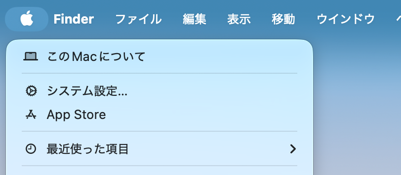

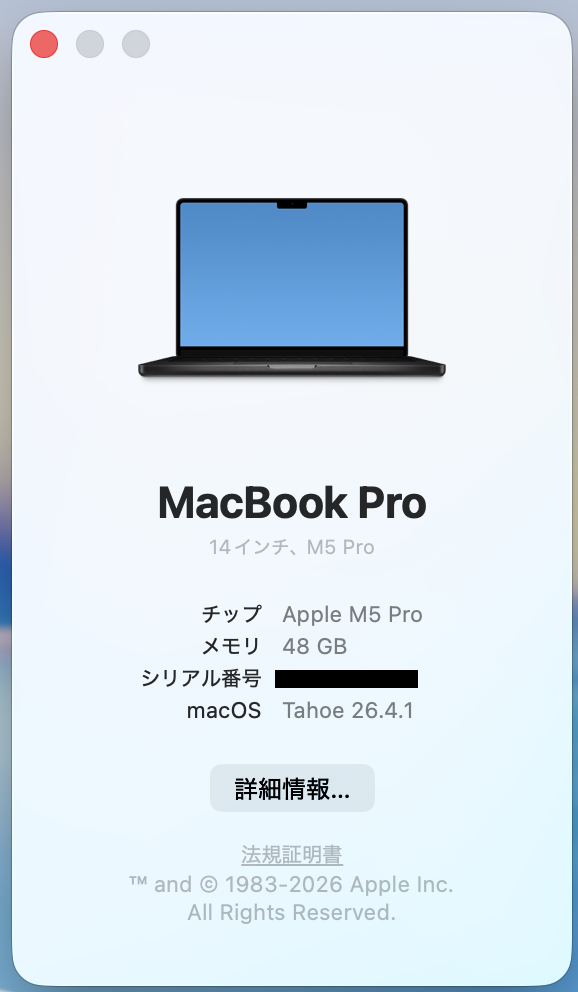

## システム設定

Dock からシステム設定を開く

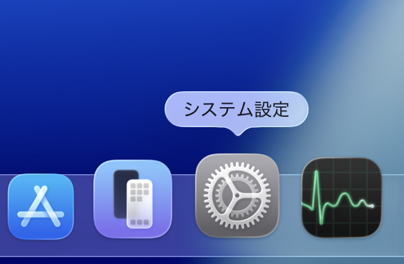

## ディスプレイ

好みの解像度に変更。詳細設定から、「解像度リストを表示」すると細かい解像度を指定可能。
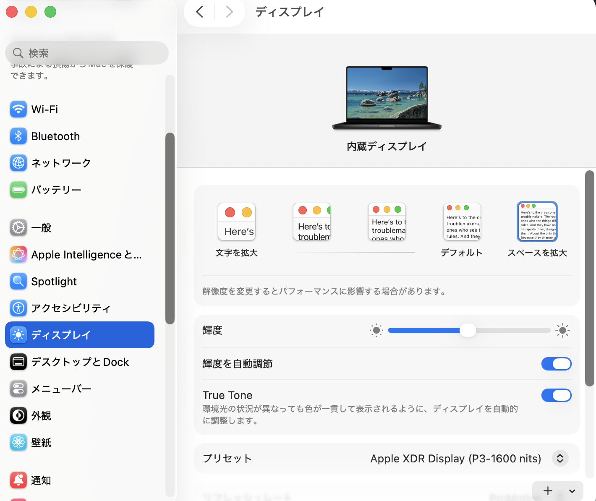

## デスクトップとDock

- Dock : 好みの大きさ・拡大率に
- Dockを自動的に表示・非表示：好みでオン
- ウィジェットを表示：好みで「デスクトップに」をオフ
- デフォルトのWebブラウザ：好みで変更（他のブラウザインストール後）

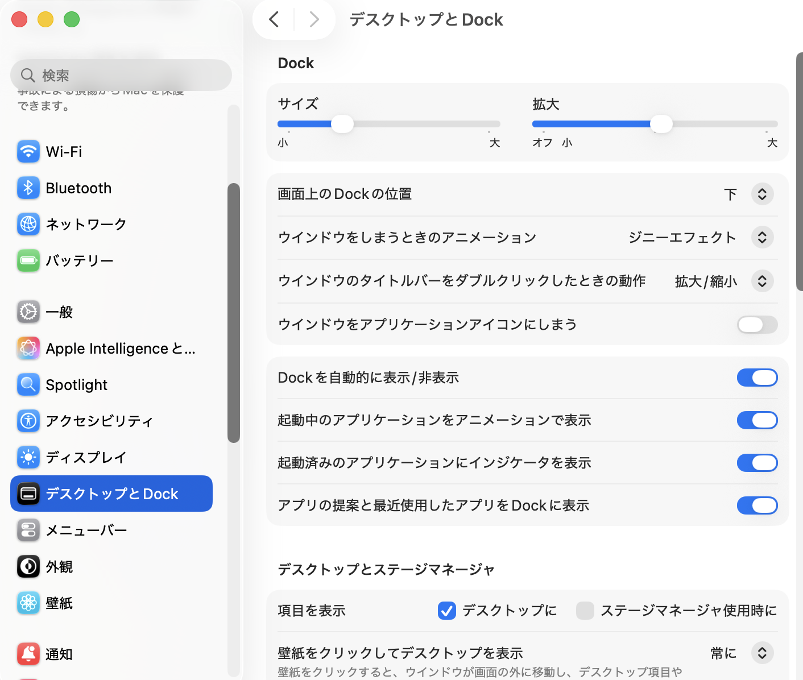

### ホットコーナー
画面の四隅にマウスカーソルを置くことで機能するショートカットがある。好みで設定。
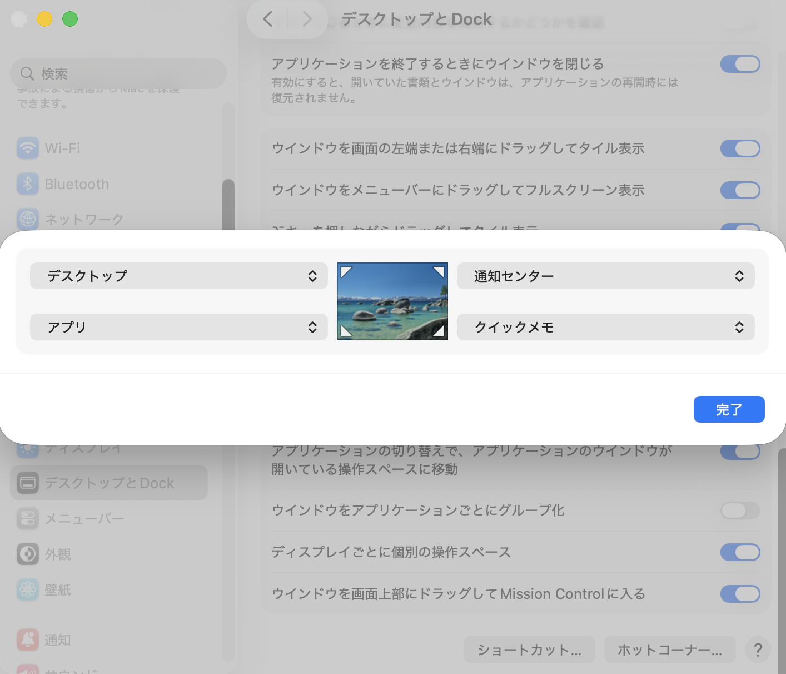
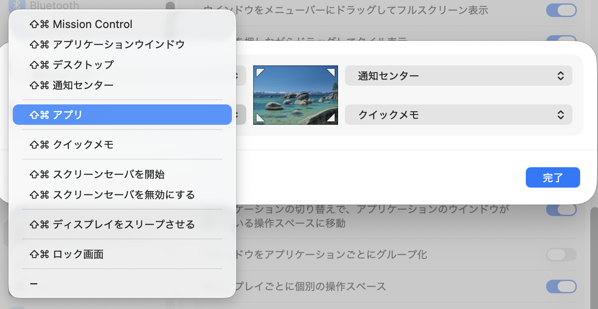

## メニューバー
画面上部のバーに表示する項目を好みで設定する。
- 時計のオプション： 好みで秒を表示する
- バッテリーオプション：好みで割合(%)を表示する
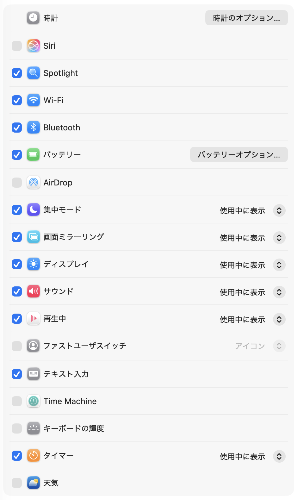

## 外観
外観モード
- 自動：日中はライトで、夜間はダークになる
- ライト：一日を通じて 白系の配色
- ダーク：一日を通じて 黒系の配色

## キーボード
好みで、キーリピート速度を変更
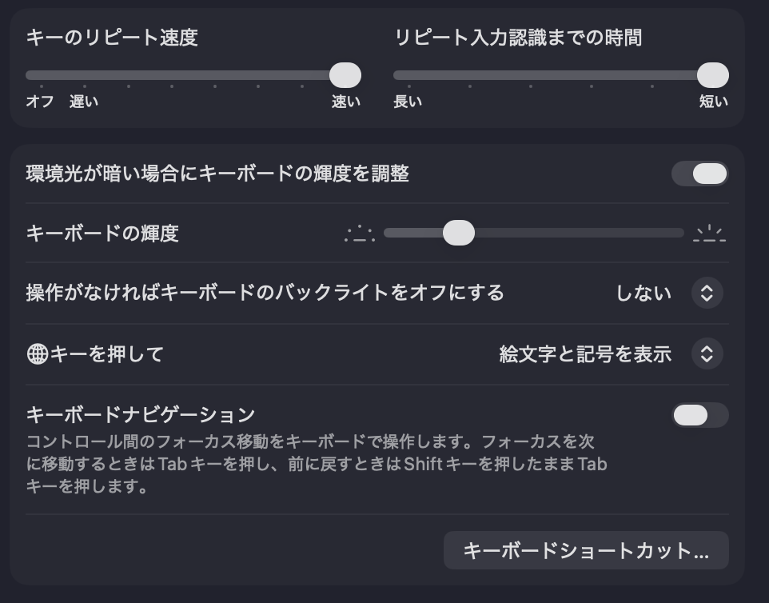

テキスト入力 > 入力ソース > 編集 　
「スペースバーを2回押してピリオドを入力」をオフ  
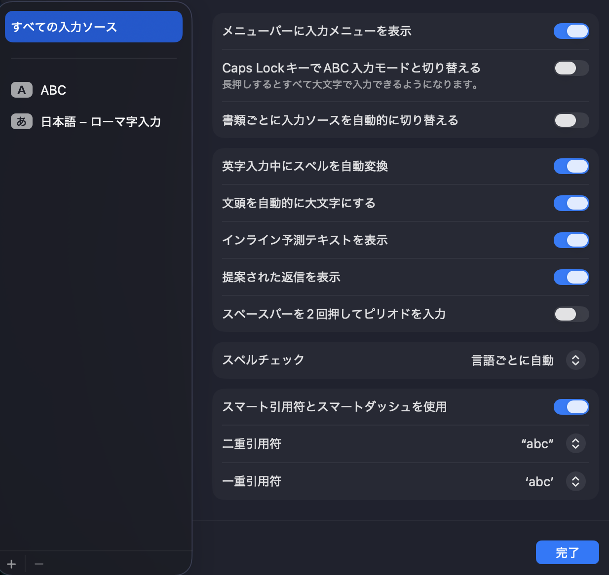

## マウス
一般的なマウス（MagicMouse以外）をよく使う場合、ナチュラルなスクロールはオフが使いやすいはず。  
MagicMouseやトラックパッドをよく使う場合、ナチュラルなスクロールはオンで。スマホやタブレットのスクロールの使用感になる。(好み)  
マウス・トラックパッドのナチュラルスクロールは同期している。
その他、好みで速さなど変更。
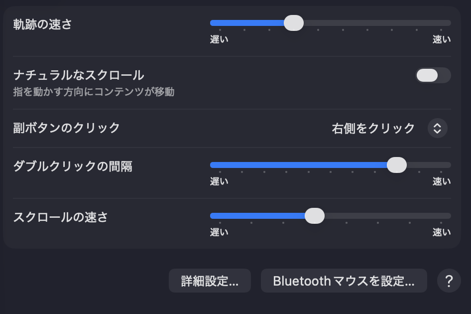

## Finder
Finderを開いて、メニューバーから設定へ 
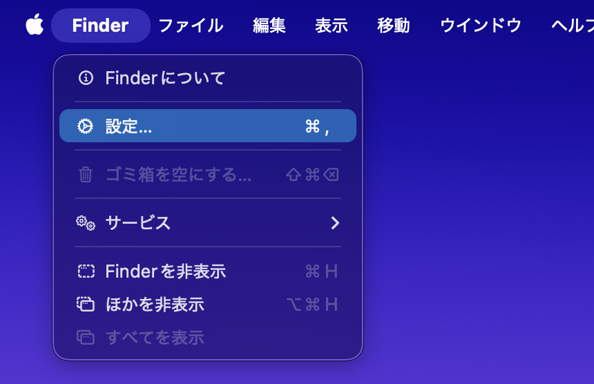

### 一般
好みで設定  
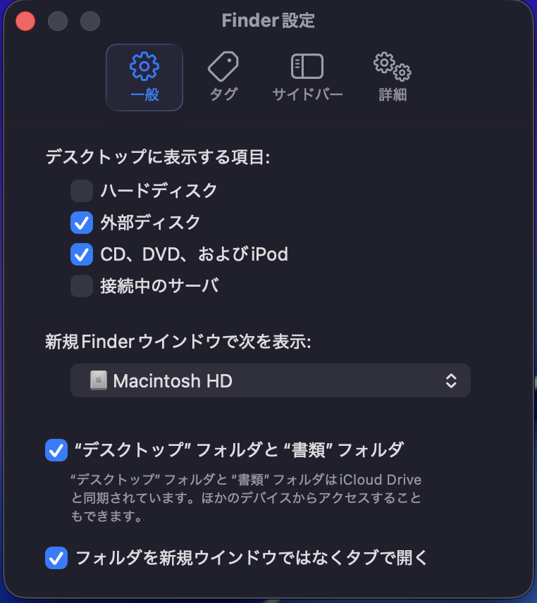
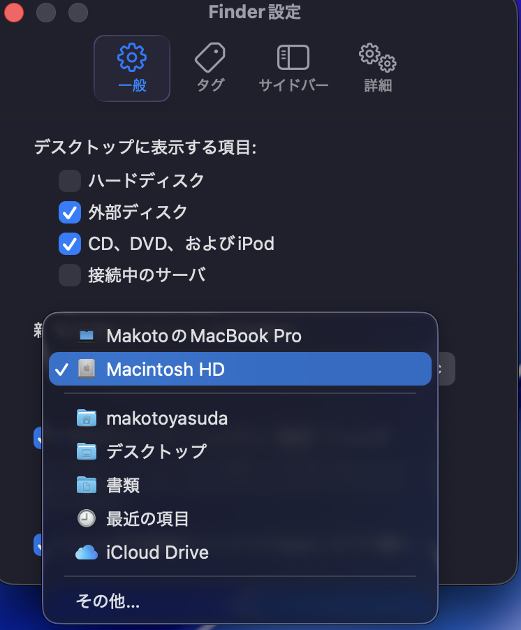

### サイドバー
好みで設定  
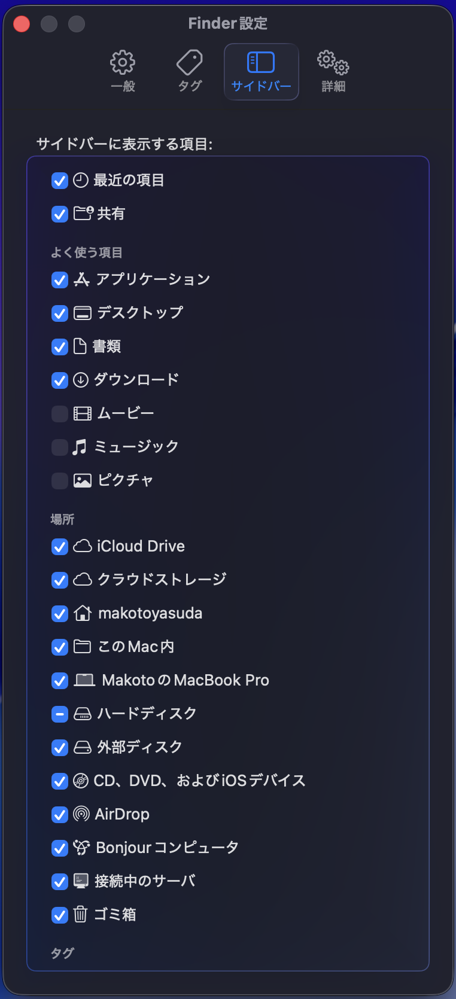

### 詳細
すべてのファイル名拡張子を表示 をチェック 　
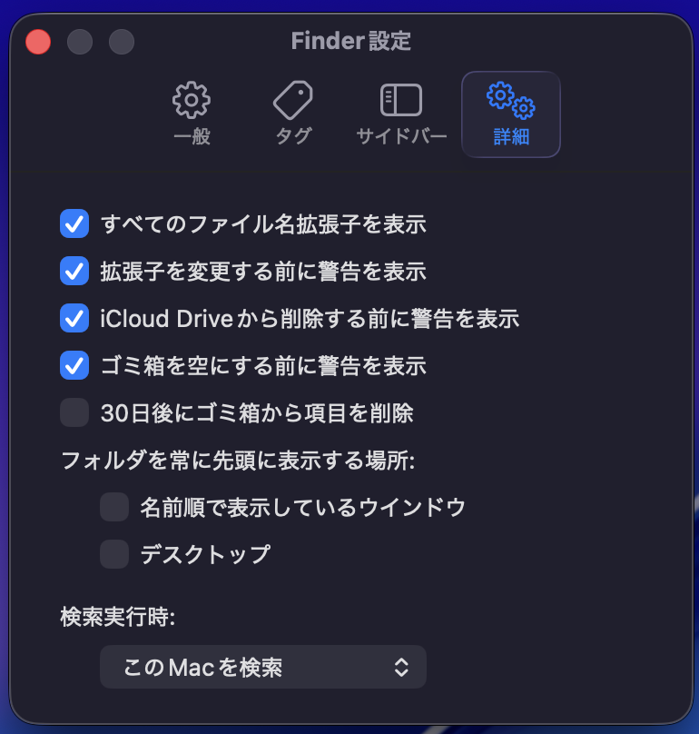

