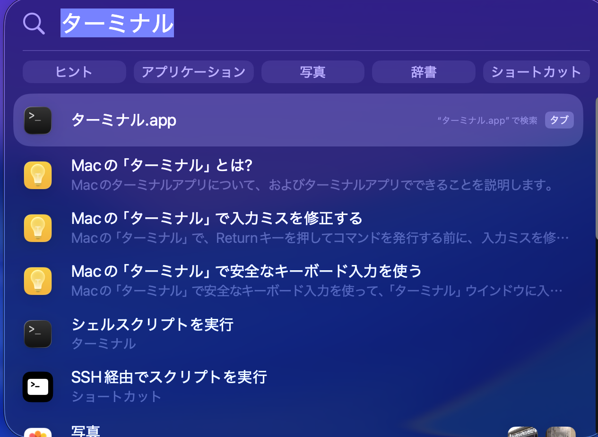
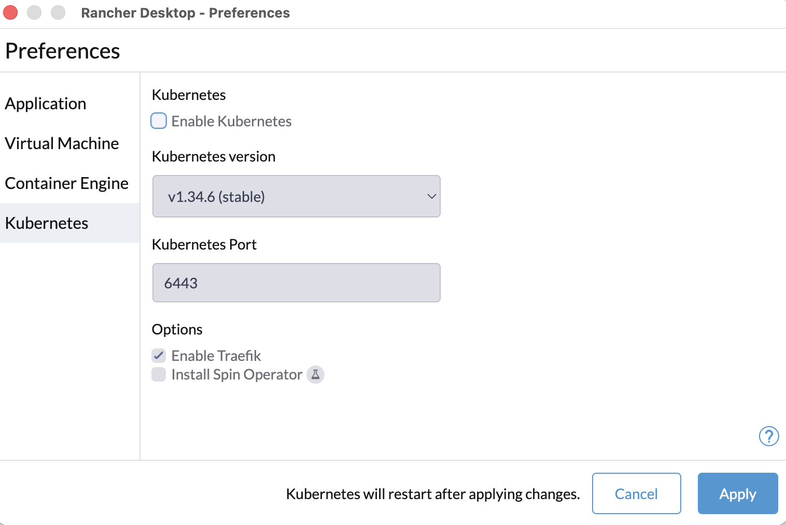
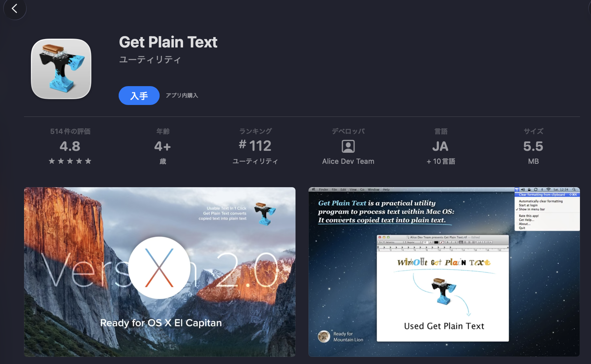
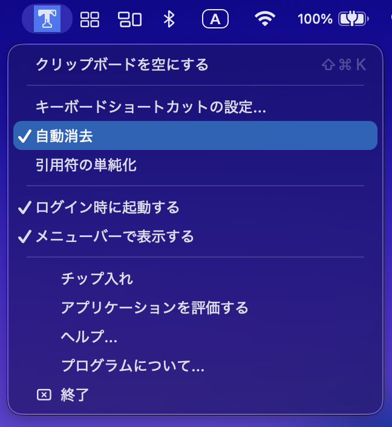
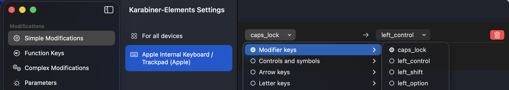

# Macセットアップ 開発ツール編

## Homebrew インストール
コマンドラインでツールをインストールできるツールをインストール。  
[HP](https://brew.sh/)のインストールコマンドを実行。  

spotlight/アプリでターミナルを実行  
※ デフォルトなら `CMD+SPACE` または メニューバーの 🔍(虫眼鏡) でspotlight呼び出し



```bash
/bin/bash -c "$(curl -fsSL https://raw.githubusercontent.com/Homebrew/install/HEAD/install.sh)"
```

```
makotoyasuda@MakotonoMacBook-Pro ~ % /bin/bash -c "$(curl -fsSL https://raw.githubusercontent.com/Homebrew/install/HEAD/install.sh)"
==> Checking for `sudo` access (which may request your password)...
Password:                                                   <-----------パスワードを入力
==> This script will install:
/opt/homebrew/bin/brew
（中略）
/opt/homebrew/Frameworks
==> The Xcode Command Line Tools will be installed.

Press RETURN/ENTER to continue or any other key to abort:   <-----------ENTERキーを入力

中略

==> Homebrew has enabled anonymous aggregate formulae and cask analytics.
Read the analytics documentation (and how to opt-out) here:
  https://docs.brew.sh/Analytics
No analytics data has been sent yet (nor will any be during this install run).

==> Homebrew is run entirely by unpaid volunteers. Please consider donating:
  https://github.com/Homebrew/brew#donations

==> Next steps: 
- Run these commands in your terminal to add Homebrew to your PATH:
                                                 <--------以下３行のコマンドを入力(xxxは自分のユーザー名)
    echo >> /Users/xxxxxxxxxxxx/.zprofile
    echo 'eval "$(/opt/homebrew/bin/brew shellenv zsh)"' >> /Users/xxxxxxxxxxxx/.zprofile
    eval "$(/opt/homebrew/bin/brew shellenv zsh)"
```

### .Brewfile準備

OSレベルのツールは brew で管理。  
GUIアプリも可能な限り brew cask で管理。

以下コマンドで、まずは.Brewfileを作成
```bash
cat <<EOF > ~/.Brewfile
brew "git-lfs"               # gitで大容量ファイル管理
brew "wget"                  # ダウンローダー
brew "pyenv"                 # Pythonバージョン管理
brew "uv"                    # Pythonパッケージマネージャー
brew "nvm"                   # nodejsパッケージマネージャー
brew "azure-cli"             # Azure CLI
brew "awscli"                # AWS CLI
brew "bash"                  # Bash
brew "direnv"                # ディレクトリごとに環境変数を設定
brew "jq"                    # JSON整形
brew "tmux"                  # 1つのターミナル画面上で複数のセッション、ウィンドウ、ペインを管理
brew "tree"                  # フォルダ構造をツリー表示
brew "bat"                   # catの強化版。カラー表示＋行番号
brew "fd"                    # findの高速版。検索が早くて簡単
brew "ripgrep"               # grep系検索ツール（速い＆正確）
brew "zsh-autocomplete"      # zsh補完
cask "clibor"                # クリップボード管理
cask "iterm2"                # ターミナル
cask "fork"                  # Git GUI
cask "slack"                 # コミュニケーションツール
cask "google-chrome"         # ブラウザ
cask "visual-studio-code"    # 開発環境・エディタ
cask "karabiner-elements"    # キーリマップ
cask "rectangle"             # ウィンドウ整理
EOF
```

上記のソフトウェアを一括でインストール
```bash
brew bundle --global
```

環境構築が一通り終えたら、以下コマンドで~/.Brewfileを更新
```bash
brew bundle dump --global -f
```

最新のパッケージ状態を維持するため、定期的に以下を実施
```bash
brew update
brew upgrade
```

## git

ユーザー名、メールアドレスは適宜自分の使用しているものに変更して実行。

```bash
git config --global user.name "xxx"
git config --global user.email "xxx@nttdata-bizsys.co.jp"
```

## .zshrc

好みもあるが、コメントを見て適宜有効・無効に

```bash
cat <<EOF >> ~/.zshrc
# init setup
## japanize
export LANG=ja_JP.UTF-8

## zsh-completions コマンドをtabでtabで補完できるように
if [ -e /usr/local/share/zsh-completions ]; then
  fpath=(/usr/local/share/zsh-completions $fpath)
fi

autoload -Uz compinit
compinit -u

zstyle ':completion:*' matcher-list 'm:{a-z}={A-Z}'    # 補完候補で、大文字・小文字を区別しないで補完出来るようにするが、大文字を入力した場合は区別する
zstyle ':completion:*' ignore-parents parent pwd ..    # ../ の後は今いるディレクトリを補間しない
zstyle ':completion:*:default' menu select=1           # 補間候補一覧上で移動できるように
zstyle ':completion:*:cd:*' ignore-parents parent pwd  # 補間候補にカレントディレクトリは含めない


## history
HISTFILE=~/.zsh_history
HISTSIZE=1000000
SAVEHIST=1000000

setopt share_history           # 履歴を他のシェルとリアルタイム共有する
setopt hist_ignore_all_dups    # 同じコマンドをhistoryに残さない
setopt hist_ignore_space       # historyに保存するときに余分なスペースを削除する
setopt hist_reduce_blanks      # historyに保存するときに余分なスペースを削除する
setopt hist_save_no_dups       # 重複するコマンドが保存されるとき、古い方を削除する
setopt inc_append_history      # 実行時に履歴をファイルにに追加していく

### 先頭が一致したコマンドの履歴を一つづつたどれる
autoload history-search-end
zle -N history-beginning-search-backward-end history-search-end
zle -N history-beginning-search-forward-end history-search-end
bindkey "^p" history-beginning-search-backward-end
bindkey "^n" history-beginning-search-forward-end

setopt correct   # コマンドのスペルを訂正
setopt nonomatch # コマンドにパターン文字列をそのまま渡せるように
setopt no_beep   # ビープ音を鳴らさない

DIRSTACKSIZE=100
setopt AUTO_PUSHD #cdで移動したディレクトリをスタックに追加

## alias
alias ls='ls -F'
alias la='ls -Fa'
alias ll='ls -Flh'
alias lla='ls -Falh'
alias ..='cd ../'
alias ...='cd ../../'

## git
autoload -Uz vcs_info
setopt prompt_subst
zstyle ':vcs_info:git:*' check-for-changes true
zstyle ':vcs_info:git:*' stagedstr "%F{magenta}!"
zstyle ':vcs_info:git:*' unstagedstr "%F{yellow}+"
zstyle ':vcs_info:*' formats "%F{cyan}%c%u[%b]%f"
zstyle ':vcs_info:*' actionformats '[%b|%a]'
precmd () { vcs_info }

### プロンプトカスタマイズ
PROMPT='
[%B%F{red}%n@%m%f%b:%F{green}%~%f]%F{cyan}$vcs_info_msg_0_%f
%F{yellow}$%f '

export CLICOLOR=1
export LSCOLORS="gxfxcxdxbxegedabagacad"

EOF
```


## node
nvmの設定を追加
```bash
mkdir ~/.nvm
cat <<EOF >> ~/.zshrc
export NVM_DIR="$HOME/.nvm"
[ -s "/opt/homebrew/opt/nvm/nvm.sh" ] && \. "/opt/homebrew/opt/nvm/nvm.sh"  # This loads nvm
[ -s "/opt/homebrew/opt/nvm/etc/bash_completion.d/nvm" ] && \. "/opt/homebrew/opt/nvm/etc/bash_completion.d/nvm"  # This loads nvm bash_completion

EOF
source ~/.zshrc
```

最新のバージョンを確認
```bash
nvm ls-remote 
```

最新のLTSをインストール
```bash
nvm install v24.15.0
```

バージョン確認
```bash
node -v
```

## 適宜インストール

### Azure Functions Core Tools
Azure Functions環境で開発する場合
```bash
brew tap azure/functions
brew install azure-functions-core-tools@4
```

### Azure Storage Explorer

```bash
brew install --cask dotnet-sdk
brew install --cask microsoft-azure-storage-explorer
```

### Azure CLI 追加設定

```bash
cat <<EOF >> ~/.zshrc

# azure cli
autoload bashcompinit && bashcompinit
source $(brew --prefix)/etc/bash_completion.d/az
EOF
```

### Rancher Desktop
コンテナ環境を使った開発をする場合
```bash
brew install --cask rancher
```
Rancher Desktopを起動する。  
Container Engine が dockerd(moby) になっているのを確認する。  
設定後、コンポーネントのインストールが行われる。
Kubernetesを使わない場合は、Enable Kubernetesのチェックを外して設定する。


ターミナルを開いて、`docker info` コマンドが実行できることを確認する。

### terraform (tenv利用)

tenvからインストールする。tfenvはしばらくアップデートがないため避ける。  
プロジェクトでバージョンが指定されている場合はバージョンを指定する。  

[tenv](https://github.com/tofuutils/tenv)

```bash
brew install cosign
brew install tenv
tenv tf install 1.13.0
terraform -v
```

### codex (cli)

```bash
brew install codex
```

### codex app

[OpenAI Developers](https://developers.openai.com/codex/app) でダウンロード。  
Download for macOS(Apple Silicon)のリンクからダウンロード・インストール。


### claude code
自動更新したいため、brewを使わず、native installする。
```bash
curl -fsSL https://claude.ai/install.sh | bash
```
コマンド実行後、PATHの設定を行う。（コマンドはコンソールに表示されている）
```bash
echo 'export PATH="$HOME/.local/bin:$PATH"' >> ~/.zshrc && source ~/.zshrc
```

### Claude デスクトップアプリ

[Claude](https://claude.com/ja-jp/download)でダウンロード・インストール


### Office系
ライセンスを持っている場合はインストール
```bash
brew install --cask microsoft-auto-update microsoft-office microsoft-teams
```

### Google 日本語入力
```bash
brew install --cask google-japanese-ime
```

### プレーンテキストでコピー
文字をコピーしたときに書式ごとコピーされてしまうのを防ぐツール  
[Get Plain Text](https://apps.apple.com/jp/app/id508368068)  



### Karabiner-Elements
caps lockを無効にしたい。


## ローカルLLM

### LM Studio

```bash
brew install --cask lm-studio
```